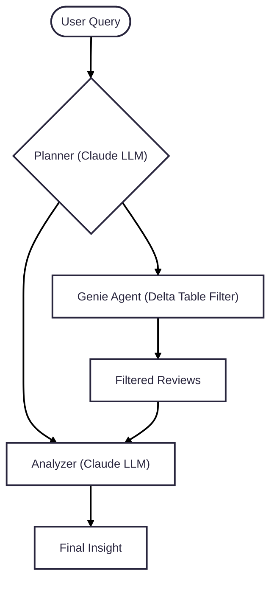

# 📕 Amazon Book Review Insight Agent

An LLM-powered, agentic system that enables natural language exploration of Amazon book reviews. Built with **LangGraph**, **Claude** and **Databricks AI/BI Genie**, it allows users to ask flexible questions and get structured, sentiment-rich insights from large-scale book review data.

📦 Dataset: [Amazon US Customer Reviews Dataset - Books (Kaggle)](https://www.kaggle.com/datasets/cynthiarempel/amazon-us-customer-reviews-dataset?select=amazon_reviews_us_Books_v1_02.tsv)

---

## 🔍 Example Queries

- "What do readers dislike about 'The Secret'?"
- "Summarize the sentiment around 'Atomic Habits' in terms of practicality and readability."
- "What themes do people frequently mention in reviews of 'The Alchemist'?"
- "Which self-help books have received the most helpful votes?"

---

## 🕸️ Workflow
- Planner: Parses user intent, generates task prompts
- AI/ BI Genie: Filters reviews from a Delta Table in Unity Catalog
- Analyzer: Uses Claude to extract sentiment, keywords, and summaries



---

## 🚀 How to Run
Set up and test the Amazon Review Insight Agent on Databricks in just a few steps:

1. Create a Genie Space in Databricks

  [Set up Genie Spaces](https://docs.databricks.com/aws/en/genie/set-up) Refer to this documentation to set up a Genie Space in Databricks for your Amazon Book review dataset. 
  
2. Upload the Notebook

  Upload the provided ```.ipynb``` notebook to your Databricks workspace.

3. Configure Environment Variables (Databricks)

  Create a scope and add your secrets:
  ```bash
  databricks secrets create-scope --scope my-secrets
  ```
  ```bash
  databricks secrets put --scope my-secrets --key DATABRICKS_HOST
  databricks secrets put --scope my-secrets --key DATABRICKS_PAT_TOKEN
  databricks secrets put --scope my-secrets --key GENIE_SPACE_ID
  ```

  Access them in your notebook:
  ```bash
  import os

  DATABRICKS_HOST = dbutils.secrets.get(scope="my-secrets", key="DATABRICKS_HOST")
  DATABRICKS_PAT_TOKEN = dbutils.secrets.get(scope="my-secrets", key="DATABRICKS_PAT_TOKEN")
  GENIE_SPACE_ID = dbutils.secrets.get(scope="my-secrets", key="GENIE_SPACE_ID")
```

4. Test the Agent

  Interact with the agent to test the output. Replace the placeholder input example with your specific questions.
  ```bash
  AGENT.predict({"messages": [{"role": "user", "content": "What are customers saying about the Kindle's battery life?"}]})
  ```

---

### 🧾 Example Output

**Query:**  
_"Which books are most often described as ‘life-changing’ in the reviews?"_

**Agent Output:**  
```text
Books Most Often Described as Life-Changing in Reviews

Based on the customer reviews provided, several books are explicitly described as "life-changing" by reviewers. Here's a comprehensive analysis of which books are most frequently mentioned as having transformative effects on readers:

Top Life-Changing Books

1. Boundaries: When to Say YES, When to Say NO, To Take Control of Your Life
   - Multiple reviewers directly state this book is "life-changing"
   - One reviewer calls it "the most life-changing book I have ever read (second to the Bible)"
   - Described as providing practical guidance for setting healthy boundaries

2. Created to be His Help Meet: Discover How God Can Make Your Marriage Glorious
   - Reviewers mention it "changed my life" and had "truly life-changing" effects
   - Described as completely reconstructing thinking about marriage relationships

3. The Search For Significance: Seeing Your True Worth Through God's Eyes
   - Described as "nothing short of powerful and life-changing for the reader"
   - Reviewer has led multiple study groups with this book

4. Journey of Souls / Destiny of Souls (by Michael Newton)
   - Described as "life-changing books and truly groundbreaking research"
   - One reviewer states "These are life-changing books" that "changed my life in so many ways"

5. Heaven (by Randy Alcorn)
   - Reviewer quotes cover: "Other than the Bible, this may be the most life-changing book you will ever read"
   - Reviewer confirms this assessment after reading

6. The Peacemaker: A Biblical Guide to Resolving Personal Conflict
   - Ranks in reviewer's "top 10 life-changing books"
   - Described as providing practical guidance for conflict resolution

7. The Highly Sensitive Person: How to Thrive When the World Overwhelms You
   - Reviewer states: "There are a few books that have made a life-changing impact on me... This book was one of them"

Other books mentioned as life-changing include:
- Going Deeper: How to Make Sense of Your Life When Your Life Makes No Sense
- Ishmael: A Novel
- Sinfully Vegan: Over 140 Decadent Desserts to Satisfy Every Vegan's Sweet Tooth
- The Trigger Point Therapy Workbook
- Padre Pio: Man of Hope
- Velvet Elvis: Repainting the Christian Faith

Common Themes in Life-Changing Books
- Spiritual/Religious Growth: Deepens faith or spiritual understanding
- Self-Help/Personal Development: Offers practical life improvement tools
- Relationship Guidance: Improves interpersonal relationships
- Health & Wellness: Tackles physical or mental health
- Alternative Perspectives: Challenges conventional thinking

Many reviewers mention these books providing clarity, hope, practical solutions to problems, or completely new ways of thinking about themselves and their relationships.
```

---

## 💬 Want to Turn This Into a Chat App?
This project can be easily extended into a chat-based web application using tools like Streamlit or Gradio. By wrapping the LangGraph chain in a backend function, users can ask natural language questions and receive real-time insights from Amazon product reviews. The agent can also be deployed as a model serving endpoint in Databricks, with a custom UI (e.g., Streamlit) as the frontend. This makes it well-suited for building interactive product feedback assistants or customer experience dashboards.

[Deploy an agent in Databricks](https://docs.databricks.com/aws/en/generative-ai/agent-framework/deploy-agent)

## 🙋‍♀️ Author
**Divyani Panda**  
_Data Scientist \| Agentic AI Developer_  

[](https://www.linkedin.com/in/divyani-panda-5a8345194/)

